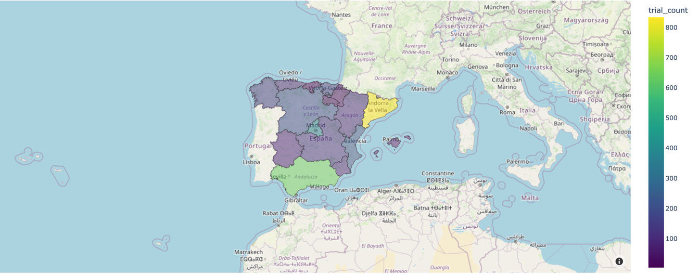

# Trialing Data Scraping Challenge as a part of interview process (Data Engineer)
## Task Summary

Create a Python script to scrape data from a specified website and store it in a local SQLite database with columns for name, address, latitude, longitude, country, region, city, and contact data. Then, using the provided `hospital_trials.csv`, store the information in the SQLite database and analyze it to determine the number of clinical trials per region, visualizing the results with an appropriate graph or plot.

## Prerequisites

- Python 3.x
- Required Python libraries: `scrapy:latest`, `sqlite3`, `plotly`, `pandas`

## Project Structure 
```
├── README.md
├── hospital_data.db
├── hospitals-data-analysis
│   ├── __init__.py
│   ├── data
│   │   └── hospital_trials.csv
│   ├── interactive.py
│   └── main.py
└── trialing-scraper
    ├── scrapy.cfg
    └── trialing
        ├── __init__.py
        ├── items.py
        ├── middlewares.py
        ├── pipelines.py
        ├── settings.py
        └── spiders
            ├── __init__.py
            └── trialing_spider.py
```
- `hospital-data-analysis` is used for analytical data processing and answering for question.
- `trialing-scraper` is used for trialing demo [website](http://trialing-talent.s3-website-eu-west-1.amazonaws.com/) parsing.

## Features
### Trialing Scraper
- **Scrapy** was used as the main tool for parsing the website. Scrapy gives excellent scalability that allows you to easily modify and add components for parsing a single website, as well as parsing several sites simultaneously simply by adding another spider (crawler).
  - Both CSS and XPath selectors were used as anchors for the HTML components
  - Scrapy presents the necessary tools to build pipelines. Thus, the DTO approach was used in this solution. DTO appears to structure unstructured data received during parsing. Then DTO, in our case `HospitalItem`, further using pipelines (`pipelines.py`) and class `SQLitePipeline` the data is stored in SQLite.
- For `hospitals data analysis` were used `Pandas` and `Plotly` for data processing and visualization. All input data (`hospital_trials`) is stored in `data` folder as best practice. 

**_NOTE:_** All code is documented and easy to read. Use the code to explore the implementation and get more information about the implementation.
## Setup and Execution
**_NOTE:_** This solution does not use containerization technology (as this would be unnecessary complexity), so keep an eye on library dependencies and versions. Use your favourite env.
- `pip install -r requirements.txt`
### Step-by-step:
1) Change directory `cd trialing-scraper`. Run website parsing using `scrapy crawl trialing_talent_spider`. This command will run spider, create `.db` file and push data into `sqlite`. The `hospital_data.db` has been created and will be used as a main DB. Use SQLite Browser or PyCharm built-in tools to browse.
2) `cd ../hospitals-data-analysis` (if in trialing-scraper folder) or `cd hospitals-data-analysis ` (if in root folder). Use `python3 csv_to_sqlite.py` command to transfer data from CSV to SQLite. The `trial_data` table was created in `hospital_data.db`.
3) Use `python3 interactive.py` command to run visualization. 
   1) To answer a question "What’s the number of clinical trials per region?" a SQL query was used:
   ```sqlite
    SELECT h.region, COUNT(td.trial_code) AS trial_count
    FROM hospitals AS h
    JOIN trial_data AS td ON h.hospital_card_id = td.hospital_id
    GROUP BY h.region;
    ```
    Query **_counts clinical trials per region_** by joining the `hospitals` and `trial_data` tables on their respective ID fields. It then groups the results by the `region` field from the `hospitals` table to provide the total number of trials for each `region`.


## Testing
At this point in time, the code does not require pytest-based tests or additional data validation as this would be an unnecessary complication of the code base.

## Future Improving
Despite the use of easily scalable components, the solution can be significantly improved. For example, it is necessary to use PubSub instructions such as AWS Kinensis or Apache Kafka to push data from crawlers to the pipeline. We need to containerise the application and implement the ability to track changes to the website and quickly augment our data without wasting resources on repetitive data parsing.
DAG-based data orchestration tools also have a place. At the same time, storing data within a Data Warehouse is rather unprofitable. The Datalake (or Data lakehouse) approach is necessary, where large data objects are stored in an object store (S3, Ceph) and will be reused only in analytics.